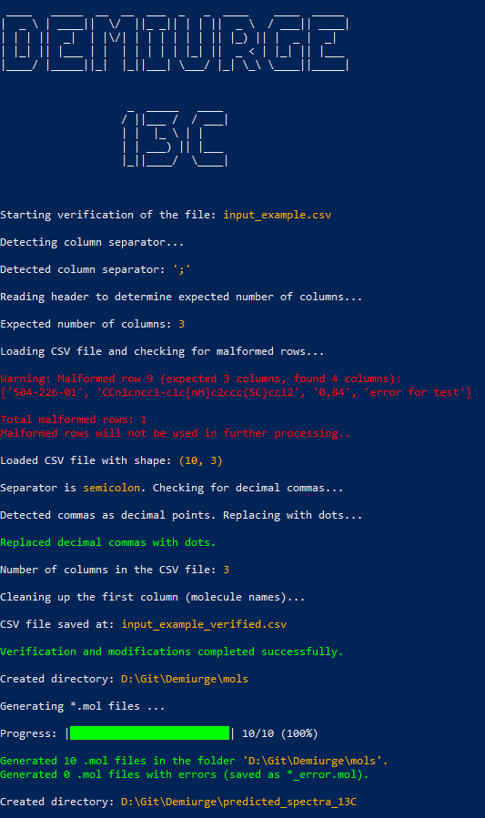
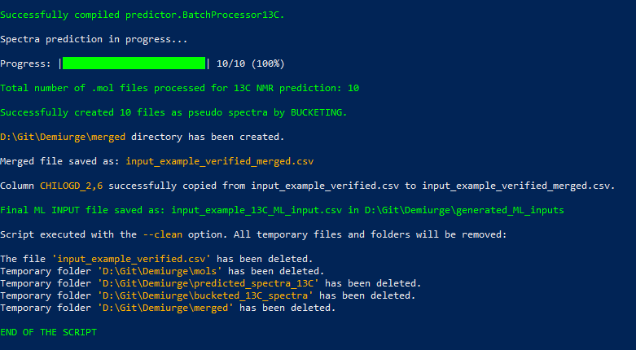

# DEMIURGE

<p align="center"></p>

## NMR (based on JEOL JASON software)  or ECFP4-based QSPR Machine Learning Input Generator

Demiurge is a modular and fully automated Python-based platform designed to generate machine learning input data from both simulated spectral and structural molecular representations. Specifically developed to support QSPR studies, it processes chemical structures provided as SMILES strings alongside target properties (e.g., CHI logD), and produces ready-to-use feature matrices for classical ML models and deep neural networks.

The tool supports four representation modes: predicted **¹H NMR** spectra, **¹³C NMR** spectra, concatenated **¹H | ¹³C** spectral vectors and **ECFP4** molecular fingerprints. Input files in `.csv` format are validated for SMILES integrity and formatting. Molecular structures are reconstructed using **RDKit** or **obabel**, optimized in 3D, then flattened to 2D to comply with NMR prediction tools.

NMR spectral predictions are performed locally with **JEOL JASON** (commercial, proprietary software by JEOL Ltd.), accessed programmatically via the `BeautifulJASON` Python API. The resulting chemical shift lists are then transformed into fixed-length spectral vectors through a custom bucketing strategy (200 bins per nucleus, but can be changed in bucketing module script), enabling compatibility with ML pipelines. In the fused representation, the 1H and 13C vectors are joined together head to tail.

[Link to JASON website](https://www.jeoljason.com/)

[Link to BeautifulJASON project page](https://pypi.org/project/beautifuljason/)


For ECFP4 generation, **RDKit's Morgan fingerprinting** (radius = 2) is used to construct 2048-bit binary descriptors. All generated feature matrices are merged with property labels (e.g., CHI logD), headers are appended, and the final datasets are saved as `.csv` files.

The architecture is fully extensible and easily adaptable to other endpoints such as **logP**, **TPSA**, or **logS**, and to other types of spectral or molecular representations.


## 🖥 Examples of Working Program

The script was run as an example for the prediction of 13C NMR spectra with an input file containing a misdefined one of the rows. In addition, a comma was inserted as the decimal separator and a semicolon was inserted as the column separator.

<p align="center"></p>
<p align="center"></p>

## 📑 Table of Contents
1. [DEMIURGE](#demiurge)
2. [NMR or ECFP4-based Machine Learning Input Generator](#nmr-or-ecfp4-based-machine-learning-input-generator)
3. [🖥 Examples of Working Program](#-examples-of-working-program)
4. [💡 Key Features](#-key-features)
5. [✅ Requirements](#-requirements)
6. [⚙️ Installation](#️-installation)
7. [🗂 Directory Structure](#-directory-structure)
8. [🚀 Usage](#-usage)
9. [📄 Command Line Arguments](#-command-line-arguments)
10. [📄 Example Usage](#-example-usage)
11. [📄 Input CSV Format](#-input-csv-format)
12. [⚙️ Script Workflow for NMR-based Output Data (1H / 13C)](#️-script-workflow-for-nmr-based-output-data-1h--13c)
13. [⚙️ Script Workflow for ECFP4-based Output Data (FP)](#️-script-workflow-for-ecfp4-based-output-data-fp)
14. [🛠 Troubleshooting](#-troubleshooting)
15. [📜 License](#-license)

## 💡Key Features

- **Molecule Generation**: Converts SMILES codes into 3D molecular structures and saves them as flattened 2D `.mol` files using RDKit.
- **NMR Spectrum Prediction**: NMR spectral predictions are performed locally with **JEOL JASON** (commercial, proprietary software by JEOL Ltd.), accessed programmatically via the `BeautifulJASON` Python API.
- **ECFP4 Fingerprints Generation**: Generates feature space using ECPF4 fingerprints with radius 2. (activated via --predictor FP)
- **Bucketization**: Converts predicted NMR spectra into a uniform matrix using a bucketing technique.
- **Data Merging**: Merges the bucketized spectra/fingerprints with property labels to form a consolidated dataset.
- **Label Insertion**: Adds a target property column to the merged dataset based on a specified label column.
- **Custom Headers**: Adds headers to the final dataset for easy identification and readability.
- **Data Concatenation**: 1H and 13C Representations are fused into new hybrid representation.
- **Optional Cleanup**: Deletes all intermediate files and folders to save space and reduce clutter.

## ✅ Requirements

**Important**: The script was tested under **Windows 10** using **PowerShell** and works reliably in this environment on **Python 3.11.4**. It has **not** been tested on Linux or other operating systems.

Ensure the following software and libraries are installed:

1. **Python Libraries**:
   - `rdkit`
   - `pandas`
   - `numpy`
   - `art`
   - `tqdm`

   Install the required Python packages using:

   ```bash
   pip install rdkit pandas numpy tqdm art
   ```
   or predefined Python script, which will check if the necessary libraries are installed. If not it will install them:

   ```bash
   python install_modules.py
   ```
2. **Open Babel**
   Open Babel is needed to process "exotic" structures that standard RDKit library can not process. Make sure the `obabel` command is available in your system's PATH.

3. **JEOL JASON (commercial) + BeautifulJASON API**

   > **Requirement:** JEOL **JASON** is **commercial, proprietary software** by **JEOL Ltd.**  
   > You must have a valid license (or request a time-limited trial from JEOL) to use it.

   - **Install JEOL JASON**
     - Download and install JASON from JEOL (license or trial required).
     - Launch JASON once to complete activation.

   - **Install the Python API (BeautifulJASON)**
     ```bash
     # activate your environment first, e.g.:
     # conda activate predictor_logD

     pip install beautifuljason
     ```
     
   - **Point BeautifulJASON to your JASON installation (if not auto-detected)**
     ```bash
     # Show current configuration (path, version, license info)
     jason_config --display

     # If JASON is not found, set the application path manually:
     # Windows example:
     jason_config --set-app "C:\Program Files\JEOL\JASON\JASON.exe"

     
### ✅ Conda Environment

If you prefer to use Conda - utilize the provided environment file to create your Conda environment:

```bash
conda env create -f conda_environment.yml
conda activate predictor_logD
```


## ⚙️ Installation

Clone the repository from GitHub and navigate to the project directory:

```bash
git clone https://github.com/Prospero1988/Demiurge_JASON.git
cd Demiurge_JASON
```

### 🗂 Directory Structure

The project is organized into the following directories and files:

```
demiurge/
│
├── demiurge.py                    # Main script for executing the pipeline
├── input_example.csv              # Example of the input file
├── install_modules.py             # Installs required Python packages
├── demiurge_bin/                  # Directory containing helper modules
│   ├── predictor_JASON.py         # Module to predict 1H or 13C spectra based on JEOL JASON Software
│   ├── csv_checker.py             # Verifies and preprocesses CSV files
│   ├── concatenator.py            # Concatenate 1H and 13C matrices into new fused matrix
│   ├── gen_mols.py                # Generates .mol files from SMILES strings
│   ├── bucket.py                  # Buckets NMR spectra
│   ├── merger.py                  # Merges bucketed spectra CSVs
|   ├── labeler.py                 # Adds labels to the merged spectra file.
│   ├── custom_header.py           # Adds custom headers to the final dataset
│   ├── fp_generator.py            # ECFP4 Fingerprints generator
│   └── model_query.py             # Queries machine learning models
└── README.md                      # Project documentation (this file)
```

## 🚀 Usage

To run the script, use the following command:

```bash
python demiurge.py --csv_path <input_csv_file> --predictor <NMR_type> --label_column <column_number> [--clean]
```

If using conda remember to activate enviriment:

```bash
conda activate predictor_logD
```

### 📄 Command Line Arguments

| Argument           | Required | Accepted Values                        | Description                                                                                                   |
|--------------------|----------|----------------------------------------|---------------------------------------------------------------------------------------------------------------|
| `--csv_path`       | ✅ Yes   | *(any valid CSV path)*                | Path to the input CSV file containing compound names and SMILES codes.                                       |
| `--predictor`      | ✅ Yes   | `1H`, `13C`, `hybrid`, `FP`            | Type of predictor: `1H` or `13C` for NMR, `hybrid` for fused 1H/13C, or `FP` for ECFP4 fingerprints.         |
| `--label_column`   | ✅ Yes   | *(integer ≥ 1)*                        | Column index (1-based) in the input CSV file that contains the target property values.                       |
| `--clean`          | ❌ No    | *(flag, no value)*                    | If set, the script will delete all intermediate temporary files and folders after execution.                 |


### 📄 Example Usage

```bash
python demiurge.py --csv_path 'test.csv' --predictor '1H' --label_column 3 --clean
```

In this example:
- The script will read the input CSV file `test.csv`.
- It will generate `.mol` files for each molecule based on its SMILES code.
- It will predict the 1H NMR spectra for each molecule.
- The spectra will be bucketized and merged into a single file.
- The target property values from `column 3` in `test.csv` will be added as labels.
- All intermediate files and directories will be deleted after execution due to the `--clean` option.

```bash
python demiurge.py --csv_path 'test.csv' --predictor 'hybrid' --label_column 3 --clean
```

In this example:
- The script will read the input CSV file `test.csv`.
- It will generate `.mol` files for each molecule based on its SMILES code.
- It will predict the 1H NMR spectra for each molecule.
- The spectra will be bucketized and merged into a single file.
- The target property values from `column 3` in `test.csv` will be added as labels.
- Script predicts 13C, buckets, merges and adds propety colums as for 1H data.
- 1H and 13C matrices are fused into concatenated representation 1H|13C.
- All intermediate files and directories will be deleted after execution due to the `--clean` option.

```bash
python demiurge.py --csv_path 'test.csv' --predictor 'FP' --label_column 3 --clean
```

In this example:
- The script will read the input CSV file `test.csv`.
- It will generate `.mol` files for each molecule based on its SMILES code.
- It will calculate ECFP4 fingerprints for each molecule using RDKit.
- The fingerprint matrix will be merged with the target property values from `column 3` in `test.csv`.
- All intermediate files and directories will be deleted after execution due to the `--clean` option.

### 📄 Input CSV Format

The input CSV file should have at least the following columns:
- `MOLECULE_NAME`: The name or identifier of the molecule.
- `SMILES`: The SMILES code of the molecule.
- `<Label>`: The property values to be modeled (must be specified in the `--label_column` parameter).

Example `test.csv`:

| MOLECULE_NAME | SMILES          | Label |
|---------------|-----------------|-------|
| Compound1     | CCCO            | 5.3   |
| Compound2     | CCC(=O)O        | 2.1   |
| Compound3     | CCN(CC)CC       | 7.8   |

### ⚙️ Script Workflow for NMR-based Output Data (1H / 13C)

1. **Step 1: Generate `.mol` Files**:
   - Reads SMILES codes from the input CSV file and generates corresponding `.mol` files using RDKit.

2. **Step 2: Predict NMR Spectra**  
   - Uses **JEOL JASON** (commercial, proprietary software by JEOL Ltd.) to predict NMR spectra for each molecule.  
   - Predictions are executed programmatically via the **BeautifulJASON** Python API, which communicates directly with the installed JASON application.  
   - The chemical-shift prediction engine built into JASON is used to generate ¹H or ¹³C spectra for subsequent processing.

3. **Step 3: Bucketize Spectra**:
   - Converts the predicted spectra into a uniform bucketized matrix for easy analysis and machine learning input generation.

4. **Step 4: Merge Spectra and Labels**:
   - Merges the bucketized spectra with the specified label column from the input CSV file.

5. **Step 5: Add Custom Headers**:
   - Adds descriptive headers to the final merged CSV file, making it easier to interpret and use for machine learning tasks.

6. **Step 6: Cleanup (Optional)**:
   - Deletes all intermediate files and directories if the `--clean` option is specified.
     

### ⚙️ Script Workflow for NMR-based Concatenated Output Data (1H|13C)

1. **Step 1: Generate `.mol` Files**:
   - Reads SMILES codes from the input CSV file and generates corresponding `.mol` files using RDKit.

2. **Step 2: Predict NMR Spectra**  
   - Uses **JEOL JASON** (commercial, proprietary software by JEOL Ltd.) to predict NMR spectra for each molecule.  
   - Predictions are executed programmatically via the **BeautifulJASON** Python API, which communicates directly with the installed JASON application.  
   - The chemical-shift prediction engine built into JASON is used to generate ¹H or ¹³C spectra for subsequent processing.

3. **Step 3: Bucketize Spectra**:
   - Converts the predicted spectra into a uniform bucketized matrix for easy analysis and machine learning input generation.

4. **Step 4: Merge Spectra and Labels**:
   - Merges the bucketized spectra with the specified label column from the input CSV file.

5. **Step 5: Add Custom Headers**:
   - Adds descriptive headers to the final merged CSV file, making it easier to interpret and use for machine learning tasks.
   - 
6. **Step 5: Concatenation od 1H adn 13C**:
   - The script connects 1H and 13C vectors head-to-tail. It combines representations for the same MOLECULE_NAME and for the same label value.

8. **Step 7: Cleanup (Optional)**:
   - Deletes all intermediate files and directories if the `--clean` option is specified.


### ⚙️ Script Workflow for ECFP4-based Output Data (FP)

1. **Step 1: Generate `.mol` Files**  
   - Reads SMILES strings from the input CSV file and converts them into 2D `.mol` files using RDKit.

2. **Step 2: Calculate ECFP4 Fingerprints**  
   - For each molecule, extended-connectivity fingerprints (ECFP4) are generated from the `.mol` structures using the RDKit implementation.

3. **Step 3: Merge Fingerprints and Labels**  
   - Merges the computed ECFP4 vectors with the label column (e.g., logD values) from the input CSV file into a unified DataFrame.

4. **Step 4: Add Custom Headers**  
   - Assigns descriptive headers to the final CSV file, improving interpretability and downstream machine learning usability.

5. **Step 5: Cleanup (Optional)**  
   - Deletes all intermediate files and directories if the `--clean` flag is used.


## 🛠 Troubleshooting

1. **JEOL JASON Setup Issues**
   - Ensure **JEOL JASON** is installed, activated, and licensed.  
     Launch the application once to complete activation.
   - Install the Python binding (**BeautifulJASON**) in the same environment as your code:
     ```bash
     pip install beautifuljason
     ```
   - Verify that BeautifulJASON can locate the JASON application:
     ```bash
     jason_config --display
     ```
     If the application is not detected, set the path explicitly:
     ```bash
     # Windows
     jason_config --set-app "C:\Program Files\JEOL\JASON\JASON.exe"
     # macOS
     jason_config --set-app "/Applications/JASON.app"
     # Linux (if applicable in your setup)
     jason_config --set-app "/opt/JASON/JASON"
     ```
   - Load all plugins when creating a session (missing plugins can lead to empty `Molecules` groups):
     ```python
     import beautifuljason as bjason
     j = bjason.JASON(plugins=None)  # load all plugins
     ```
   - Smoke test: confirm a `.mol` is actually imported
     ```python
     import os
     import beautifuljason as bjason

     test_mol = "example.mol"  # replace with a real, small MOL file
     j = bjason.JASON(plugins=None)
     with j.create_document(os.path.abspath(test_mol), rules="off") as doc:
         mols = list(doc.mol_data)
         assert mols, "No molecules imported—check plugins, path, license, or the MOL file integrity."
         print(f"OK: imported {len(mols)} molecule(s).")
     ```
   - Common errors & fixes:
     - `object 'Molecules' doesn't exist` or `doc.mol_data` is empty → use `plugins=None`, verify the file path and format (`.mol`/`.sdf`), ensure JASON is activated/licensed, try an SDF export if needed.
     - “Application not found” → run `jason_config --set-app ...` and re-check with `jason_config --display`.
     - Headless/remote environments → JASON must be installed locally; GUI/desktop availability may be required depending on your OS and license model.

2. **Missing Dependencies**:
   - Ensure that all required Python libraries (`rdkit`, `pandas`, and `numpy`) are installed.

3. **File Not Found Errors**:
   - Verify the paths to input files and directories. Ensure that the input CSV file and other necessary files are correctly specified.

4. **Memory or Performance Issues**:
   - If handling a large dataset, consider increasing the memory allocation for the Java runtime by adjusting the `-Xmx` parameter in the script.
  
     
## 📜 License

This project is licensed under the MIT License — see the [LICENSE](LICENSE) file for details.

> **Third-party software notice**  
> The project integrates with **JEOL JASON** (commercial, proprietary software by **JEOL Ltd.**).  
> **JASON is not included** and **requires a separate license** (or a time-limited trial) obtained from JEOL.  
> You must install and activate JASON to use the prediction features.

> **Python API**  
> Access from Python is provided via **BeautifulJASON** (`beautifuljason`), which is distributed and licensed **separately**.  
> Refer to that package’s own documentation and license for terms.

Trademarks and product names are the property of their respective owners. This repository contains only glue code; no JEOL binaries or license keys are distributed.


---

📖 For detailed background and scientific context, see the accompanying publication:  
(placeholder for DOI and link after publication)
